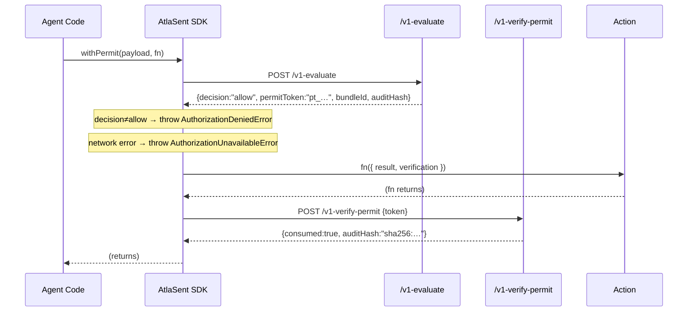

# AtlaSent SDKs

Execution-time authorization for AI agents.
Fail-closed by design — no action proceeds without an explicit permit.

| Language   | Package           | Install                    | Source                           |
|------------|-------------------|----------------------------|----------------------------------|
| Python     | `atlasent`        | `pip install atlasent`     | [`./python/`](./python/)         |
| TypeScript | `@atlasent/sdk`   | `npm i @atlasent/sdk`      | [`./typescript/`](./typescript/) |

---

## How it works



Every other outcome — `deny`, `hold`, `escalate`, network error, expired permit — throws before the callback runs.

---

## 30-second quickstart

### Python

```python
from atlasent import protect, configure

configure(api_key="sk_...")          # or set ATLASENT_API_KEY

permit = protect(
    agent="ci-deploy-bot",
    action="deployment.production",
    context={
        "commit":              "abc123",
        "signed_attestation":  True,
        "environment":         "production",
    },
)
# If we reached here, action is authorized.
# protect() raised AtlaSentDeniedError if the decision was not allow.
run_deploy()
```

### TypeScript

```typescript
import { configure, withPermit } from '@atlasent/sdk';

configure({ apiKey: process.env.ATLASENT_API_KEY! });

await withPermit(
  {
    actor:  { id: 'agent:ci-bot',    type: 'agent' },
    action: { id: 'deploy-abc123',   type: 'deployment.production' },
    target: { id: 'svc-checkout',    type: 'service', environment: 'production' },
    context: { commit: 'abc123', signed_attestation: true },
  },
  async ({ result, verification }) => {
    console.log(`permit: ${result.permitToken}`);
    console.log(`audit:  ${verification.auditHash}`);
    await runDeploy();
  },
);
// withPermit throws AuthorizationDeniedError if decision !== 'allow'.
// It throws AuthorizationUnavailableError on any network or server error.
```

---

## Three primitives

| What you want | Python | TypeScript |
|---|---|---|
| Fail-closed execution (recommended) | `protect(agent, action, context)` | `withPermit(payload, fn)` |
| Fail-closed, no callback | `protect()` then call code | `authorize(payload)` |
| Raw four-value decision | `evaluate(agent, action, context)` | `evaluate(payload)` |

### Decisions

```
type Decision = 'allow' | 'deny' | 'hold' | 'escalate'
```

Only `allow` permits execution. `authorize()` and `protect()` throw on all three non-allow values.

### Fail-closed matrix

| Situation | SDK throws | Action runs? |
|---|---|---|
| `decision === 'allow'`, permit consumed | — | ✓ |
| `decision !== 'allow'` | `AuthorizationDeniedError` | ✗ |
| Network error, timeout, 5xx | `AuthorizationUnavailableError` | ✗ |
| Permit replay or expired | `PermitVerificationError` | ✗ |

---

## Explicit evaluate → permit → verify

When you need to inspect the intermediate steps yourself:

### Python

```python
from atlasent import evaluate, verify, AtlaSentDeniedError

# Step 1 — evaluate (raw decision)
result = evaluate(
    agent="agent:data-pipeline",
    action="dataset.export",
    context={"hipaa_baa_active": True, "de_identified": False},
)

print(f"decision: {result.decision}")   # allow | deny | hold | escalate
print(f"bundle:   {result.bundle_id}@{result.bundle_version}")

if result.decision != "allow":
    raise SystemExit(f"blocked: {result.reason}")

# Step 2 — execute your action (permit is held in result.permit_token)
export_dataset()

# Step 3 — verify (produces tamper-evident proof)
proof = verify(result.permit_token)
print(f"audit hash: {proof.audit_hash}")
print(f"consumed:   {proof.consumed}")
```

### TypeScript

```typescript
import { AtlaSentClient, AuthorizationDeniedError } from '@atlasent/sdk';

const client = new AtlaSentClient({ apiKey: process.env.ATLASENT_API_KEY! });

// Step 1 — evaluate
const result = await client.evaluate({
  actor:   { id: 'agent:data-pipeline', type: 'agent' },
  action:  { id: 'export-001',          type: 'dataset.export' },
  target:  { id: 'dataset:phi',         type: 'dataset', environment: 'production' },
  context: { hipaa_baa_active: true },
});

console.log(`decision: ${result.decision}`);
if (result.decision !== 'allow') throw new Error(`blocked: ${result.reason}`);

// Step 2 — execute
await exportDataset();

// Step 3 — verify
const proof = await client.verifyPermit({ token: result.permitToken });
console.log(`audit hash: ${proof.auditHash}`);
```

---

## Deployment gate demo

Run the built-in examples to see a live block → allow flow:

```bash
# TypeScript
git clone https://github.com/AtlaSent-Systems-Inc/atlasent.git
cd atlasent && pnpm install
pnpm --filter @atlasent/examples example:deploy   # offline stub

# Or against the live API:
ATLASENT_API_KEY=sk_... pnpm --filter @atlasent/examples example:deploy
```

Expected output:
```
━━━━━━━━━━━━━━━━━━━━━━━━━━━━━━━━━━━━━━━━━━━━━━━━
  SCENARIO 2 — Production deployment gate   [STUB]
━━━━━━━━━━━━━━━━━━━━━━━━━━━━━━━━━━━━━━━━━━━━━━━━

▸ Attempt #1: deploy without attestation (BLOCKED)
  ✓ CI gate held: decision=deny
     reason:       production deploy requires a signed build attestation

▸ Attempt #2: deploy with attestation attached (ALLOWED)
    $ kubectl rollout deploy abc123 → production fleet …
  ✓ deployed under permit pt_000001
     bundle:       github-production-deploy-gate@1.0.0
     audit hash:   sha256:7f3a…
```

---

## API wire format

Both SDKs target two endpoints:

### POST /v1-evaluate

Request:
```json
{
  "actor":   { "id": "agent:ci-bot", "type": "agent" },
  "action":  { "id": "deploy-abc123", "type": "deployment.production" },
  "target":  { "id": "svc-checkout", "type": "service", "environment": "production" },
  "context": { "commit": "abc123", "signed_attestation": true }
}
```

Response (allow):
```json
{
  "decision":     "allow",
  "permitToken":  "pt_01JXYZ…",
  "id":           "ev_01JXYZ…",
  "bundleId":     "github-production-deploy-gate",
  "bundleVersion":"1.0.0",
  "policyId":     "pol_01JXYZ…",
  "reason":       null,
  "evaluatedAt":  "2026-05-19T12:00:00.000Z"
}
```

Response (deny):
```json
{
  "decision":  "deny",
  "id":        "ev_01JXYZ…",
  "bundleId":  "github-production-deploy-gate",
  "bundleVersion": "1.0.0",
  "reason":    "production deploy requires a signed build attestation",
  "evaluatedAt": "2026-05-19T12:00:00.000Z"
}
```

### POST /v1-verify-permit

Request:
```json
{ "token": "pt_01JXYZ…" }
```

Response:
```json
{
  "consumed":   true,
  "valid":      true,
  "auditHash":  "sha256:7f3a4b…",
  "verifiedAt": "2026-05-19T12:00:00.001Z"
}
```

Wire-format parity: a Python permit token is verifiable from the TypeScript SDK and vice-versa.

---

## Repository layout

```
atlasent-sdk/
├── python/         # Python SDK — pip install atlasent
│   ├── atlasent/     package source
│   ├── examples/     runnable Python examples
│   └── tests/        pytest suite
├── typescript/     # TypeScript SDK — npm i @atlasent/sdk
├── contract/       # Shared API contract — schemas, drift detector
└── .github/
    └── workflows/  # per-language CI, path-filtered
```

---

## Regulated-industry policy packs

| Pack | Frameworks |
|---|---|
| `clinical-trial-data-publish` | ICH E6(R2), ICH E9, 21 CFR Part 11, 21 CFR 312, EU CTR 536/2014, ALCOA+ |
| `gxp-change-control` | ICH Q10, ICH Q9, EU GMP Annex 11/15, 21 CFR 211.100, GAMP 5 |
| `pharma-batch-release` | EU GMP Annex 16, 21 CFR 211.22/165/167/192, ICH Q7 |
| `medical-device-software-release` | 21 CFR Part 820, ISO 13485:2016, IEC 62304, ISO 14971:2019, EU MDR 2017/745 |
| `github-production-deploy-gate` | Any team — signed attestation, branch protection, approver quorum |

---

## Getting an API key

Sign up at [atlasent.io](https://atlasent.io) → Settings → API Keys.

## License

Licensed under the [Apache License, Version 2.0](./LICENSE). See [NOTICE](./NOTICE).

Copyright (c) AtlaSent IP Holdings LLC · [legal@atlasent.io](mailto:legal@atlasent.io)
