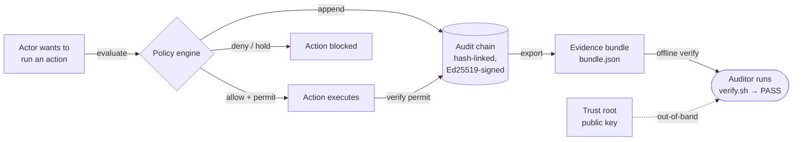

# Architecture — where this evidence comes from (5 minutes)

## What AtlaSent is

AtlaSent is an **execution-time authorization** system. Before a consequential
action runs — a production deploy, a vendor payment, a customer-data export, an
AI agent's tool call — the actor asks AtlaSent "am I authorized to do this?" and
proceeds **only** on an explicit, server-issued permit. No permit, no action.
This is the classic *reference monitor* pattern (Anderson, 1972): complete
mediation, tamper-resistance, and verifiability.

The distinguishing property — and the thing this package lets you check — is the
**proof**: every decision is recorded in a tamper-evident, hash-linked,
Ed25519-signed chain that a third party can verify **offline**, without trusting
the system that made the decision.

## The decision lifecycle

1. **Evaluate.** The actor calls `evaluate`. The policy engine returns one of
   four decisions — `allow`, `deny`, `hold`, `escalate` — and, on `allow`, a
   short-lived permit. The system is **fail-closed**: on any error, timeout, or
   absence of an active policy, the answer is *deny*.
2. **Record.** Before the response is returned, the decision is appended to an
   **immutable, hash-linked audit chain**. Each entry's hash binds the prior
   entry's hash, so the chain is append-only and tamper-evident.
3. **Verify (execution).** When the action runs, the permit is verified
   server-side and consumed (single-use). That verification is itself recorded.
4. **Export.** For an audit, a slice of the chain is exported as an **evidence
   bundle** — the `bundle.json` in this package: the decision records, the chain
   anchors, a Merkle summary, and an Ed25519 signature over the whole thing.
5. **Verify (offline).** You — the auditor — run `verify.sh`. It recomputes
   every hash and the signature against the published trust root. No part of
   this step contacts AtlaSent.

## What the evidence bundle contains

`bundle.json` is a single JSON file:

| Field | Meaning |
|---|---|
| `records[]` | The decision entries. Each has `decision_id`, `decision`, `prev_hash`, and `entry_hash`. |
| `chain_context` | Anchors: `entry_count`, `first_prev_hash`, `first_entry_hash`, `last_entry_hash`. Pins the slice into the larger chain. |
| `summary_hash` | RFC 6962 Merkle root over the record hashes. |
| `signature` | `{ alg: "Ed25519", key_id, signature_b64 }` over the canonical bundle (signature field omitted). |
| `bundle_id`, `issued_at`, `issued_by`, `scope` | Provenance metadata, all covered by the signature. |

`trust-root.json` holds the **public** keys (`issuing_keys[]` with `key_id`,
`alg`, `public_key_b64`). The bundle's `signature.key_id` must resolve to one of
them.

## Why offline matters

An audit log you have to ask the audited system to vouch for is weak evidence —
the system could lie. Because this bundle is **self-verifying against a public
key you hold**, its integrity does not depend on AtlaSent being online, honest,
or even still in business at verification time. That independence is the whole
point; the rest of this package is the detail behind it.
